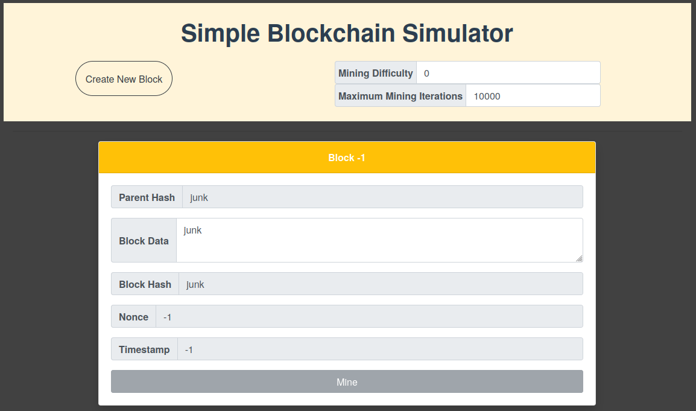
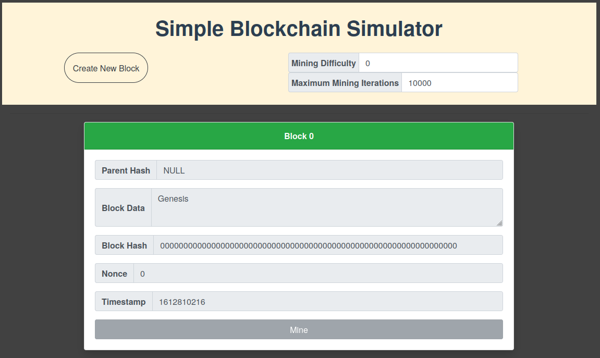
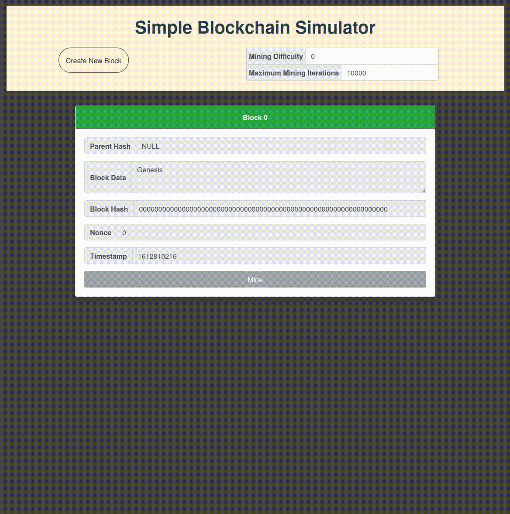
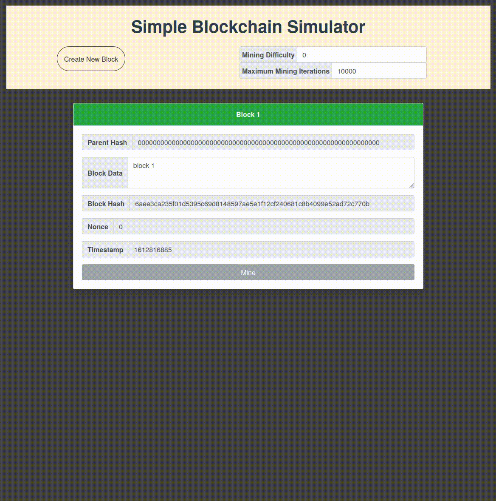
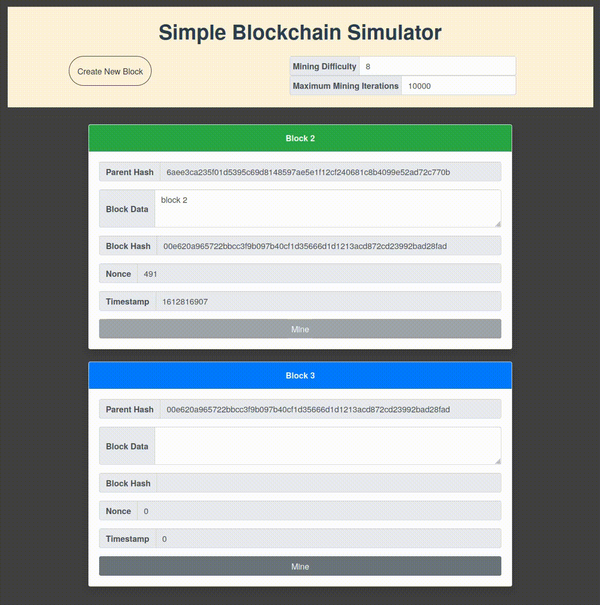
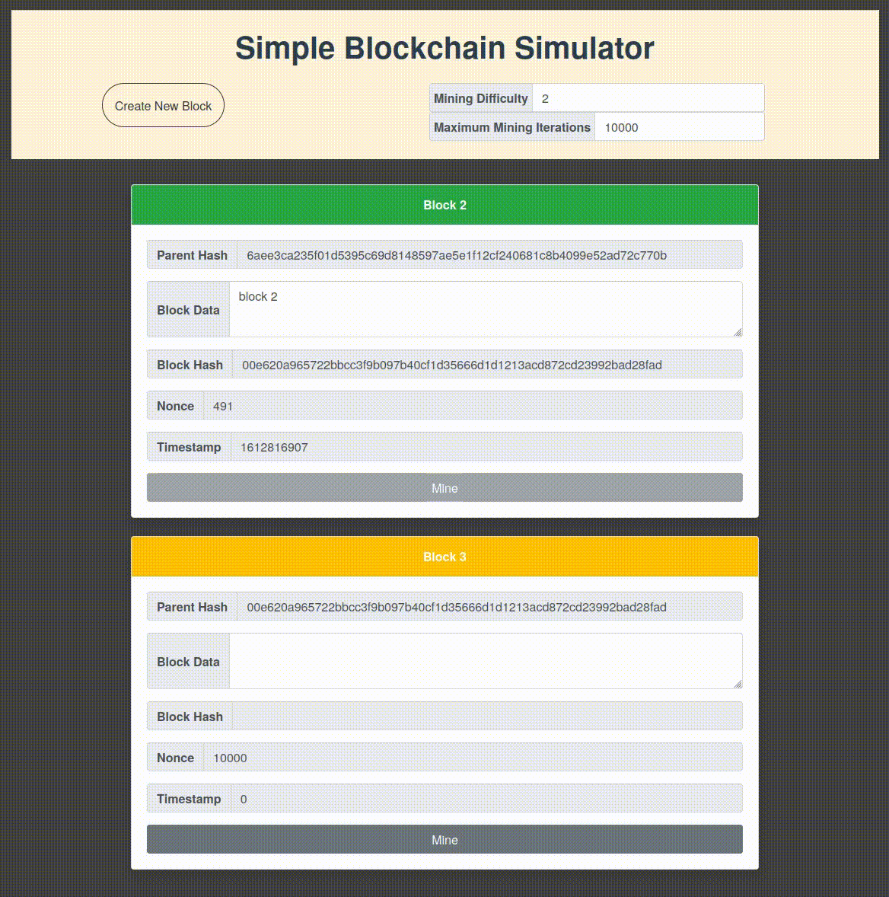

# A Simple Blockchain Implementation

Welcome! This is a simple blockchain implementation for demonstration of how blockchains work on a fundamental level. This implementation does not include a wallet, public ledger, the use of owner keys, the use of Merkle trees and some other features discussed in the [original bitcoin paper](https://bitcoin.org/bitcoin.pdf). Therefore, it is not recommended that this implementation be used for anything beyond learning and demonstration purposes. Regardless, this implementation is provided for educational purposes as free & open-source software.

For more details on technologies used and for project setup, see the ```README``` files in the [backend](/backend/README.md) and the [frontend](/frontend/README.md) sub-directories.

<br>

<hr>

## Table of Contents

* [Project Setup](#project-setup)
* [Build and Run Backend Server](#build-and-run-backend-server)
* [Build and Run Frontend Server](#build-and-run-frontend-server)
* [The Blockchain](#the-blockchain)
  - [Create and Mine a New Block](#create-and-mine-a-new-block)
  - [Change the Mining Difficulty](#change-the-mining-difficulty)
  - [A Failed Mining Attempt](#a-failed-mining-attempt)
  - [Change the Maximum Number of Mining Iterations](#change-the-maximum-number-of-mining-iterations)
  - [Tamper Resistance](#tamper-resistance)

<br>

<hr>

### Project Setup

Prior to building the code for the first time, i.e. after a fresh clone, the project's git submodules need to be brought into the project. The process to achieve this task is listed for various operating systems as follows:

<details>
<summary>Debian / Ubuntu</summary>
    
  - open a terminal
  - `cd` into the `parent` directory (containing the `.gitmodules` file)
  - run the command string
        
            git submodule update --init --recursive --remote

</details>

<br>

**NOTE:** the project is purposefully broken into different [git](https://git-scm.com/) repositories to illustrate the usage of [submodules](https://git-scm.com/book/en/v2/Git-Tools-Submodules).

<br>

\[[toc](#table-of-contents)\]

<hr>

## Build and Run Backend Backend Server

A ```Dockerfile``` is provided to build and run the server in a ```Docker``` container. ([Docker](https://www.docker.com/) will need to be installed on the build machine.) In the ```backend``` directory containing the ```Dockerfile```, use the following commands:

To build the container
```console
docker build -t blockchain .
```
To run the container
```console
docker run -t -d -p 5000:5000 blockchain:latest
```
Visit ```http://localhost:5000``` in the browser to view the Genesis block (or current last block in the chain). Note that the blockchain only "lives" as long as the server is running. Rebooting the server resets the blockchain to the Genesis block.


\[[toc](#table-of-contents)\]

<hr>

## Build and Run Frontend Server
A ```package.json``` file is included with all required dependencies. In the ```frontend``` directory
```console
yarn install
```
This will install all dependencies in the local ```node_modules``` directory.
Note this is only needed for the first compile to generate the ```yarn.lock``` file.

To build and run the development server, in the ```frontend``` directory
```console
yarn serve
```
Note the frontend runs interactively at
```console
http://localhost:8080
```

Visiting the frontend without the backend server running will provide the following:



If the backend server is running, the frontend will display the last block in the blockchain. For a new blockchain, this is the Genesis block.


 \[[toc](#table-of-contents)\]

## The Blockchain

### Create and Mine a New Block

A new block can be created by clicking the ```Create New Block``` button. The block will have the hash of the previous block as its parent hash. When a new block is created, its header is blue  until it has been successfully mined (and hence added to the end of the chain). Click ```Mine``` to attempt to mine the block. A successfully mined block has a green  header and its ```Mine``` button is disabled.

Only one leading block can be created at a time. In other words, the ```Create New Block``` button is disabled until the lead block being displayed is successfully mined.

While mining, a block header will turn a lighter blue . This will likely only be observed when attempting to mine at higher difficulties which require millions of attempts. Note in this state the Nonce will also display 0.


 \[[toc](#table-of-contents)\]

### Change the Mining Difficulty

The mining difficulty can be changed in the ```Mining Difficulty``` input field.  The mining difficulty must be a positive number and it must be greater than or equal to the difficulty of the last successfully mined block on the chain. The mining difficulty translates to the minimum number of leading '0s' in the block hash. For example, a mining difficulty of 2 will result in a minimum of 2 leading 0s in the block hash once it is successfully mined.

Note that the higher the difficulty, the longer (on average) it takes to successfully mine a block.

 
\[[toc](#table-of-contents)\]

### A Failed Mining Attempt

The header for a block that is not successfully mined turns orange . The nonce will also equal the value in the ```Maximum Mining Itertaions``` input field.

To attempt to re-mine it, it is recommended the [difficulty be lowered](#change-the-mining-difficulty) or the [maximum number of mining iterations be increased](#change-the-maximum-number-of-mining-iterations).


 \[[toc](#table-of-contents)\]

### Change the Maximum Number of Mining Iterations

The capability to change the maximum number of attempts at mining a block is provided to ensure a reasonable run time for the simulator. If a mining attempt fails, the maximum number of attempts can be increased in the ```Maximum Mining Itertaions``` input field.

 
 \[[toc](#table-of-contents)\]

### Tamper Resistance

The blockchain offers frontend tamper resistance (in addition to the backend proof checking and immutability of blocks once they are mined). If the data for a block is altered, that block's header and all downstream block headers turn red . Until the data in the altered block is restored to its mined state, all future mining is disabled. Blocks upstream of an altered block retain their green  headers.

 
 \[[toc](#table-of-contents)\]